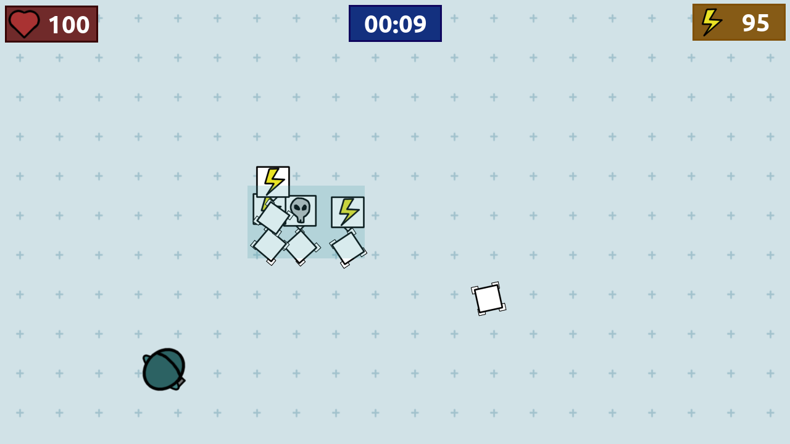

# Tiny revolution

It’s a bad day at the laboratory! Lots of tiny creatures has broken free and they are coming for you. Hold on as long as you can but keep in mind: not all creatures are bad!

## Mechanics

- Survive for as long as possible.
- Scan the creatures to tell good and bad ones apart.
- Shot the bad ones!

**There is an ingame tutorial**
